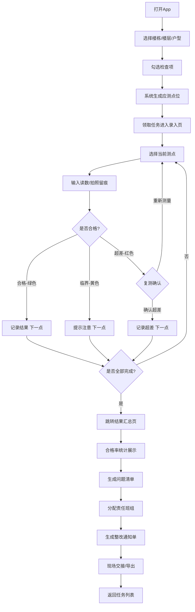

## 1. 产品概述

面向总包项目部施工员的移动端质量实测实量工具，解决现场边测边记、回办公室补录容易漏项的痛点问题。通过规范化的测量流程、实时超差预警和即时整改清单输出，提升实测实量效率和数据准确性。

- 目标用户：总包项目部施工员、质量工程师
- 核心价值：现场即测即录、超差实时提醒、结果一键交接
- 应用场景：主体结构验收、装饰装修阶段分户质量验收、日常质量巡检

## 2. 核心功能

### 2.1 用户角色

| 角色 | 登录方式 | 核心权限 |
|------|---------|---------|
| 施工员 | 工号登录 | 领取任务、录入测量数据、查看本层结果 |
| 质量工程师 | 工号登录 | 分配任务、复核数据、查看全楼统计 |

### 2.2 功能模块

1. **任务列表页**：楼栋/楼层/户型选择、检查项配置、应测点位预览、任务领取
2. **测量录入页**：逐点数据录入、拍照留痕、合格/临界/超差颜色标识、复测提示
3. **结果汇总页**：合格率统计、问题清单生成、班组整改交接、结果导出

### 2.3 页面详情

| 页面名称 | 模块名称 | 功能描述 |
|---------|---------|---------|
| 任务列表页 | 楼栋选择器 | 支持下拉选择楼栋编号，如1#、2#、3#楼 |
| 任务列表页 | 楼层选择器 | 支持数字滚动选择楼层，B2~33层 |
| 任务列表页 | 户型选择器 | 展示本层所有户型，如A户型(三房)、B户型(两房) |
| 任务列表页 | 检查项配置 | 可勾选检查项：墙面垂直度、平整度、开间进深、阴阳角方正、地面平整度、净高 |
| 任务列表页 | 点位预览表 | 按规范展示每个检查项的应测点数，如墙面垂直度每面墙3个点 |
| 任务列表页 | 领取任务按钮 | 确认后进入测量录入页 |
| 测量录入页 | 户型平面图 | 显示房间点位分布示意图，当前测位高亮 |
| 测量录入页 | 测点进度条 | 显示当前项进度，如"3/10"已测3点共10点 |
| 测量录入页 | 数值输入框 | 支持数字键盘输入读数，单位mm |
| 测量录入页 | 拍照按钮 | 调用相机拍照留痕，可添加备注 |
| 测量录入页 | 状态指示卡 | 绿色=合格、黄色=临界(±80%偏差)、红色=超差 |
| 测量录入页 | 复测提示弹窗 | 超差时自动弹出，可选"确认超差"或"重新测量" |
| 测量录入页 | 上一点/下一点 | 快速切换测点，已测点灰显 |
| 结果汇总页 | 合格率概览卡 | 本层/本户型总体合格率，分项合格率环形图 |
| 结果汇总页 | 问题清单表格 | 按房间列出超差点位、偏差值、照片缩略图 |
| 结果汇总页 | 整改责任分配 | 选择责任班组，设置整改期限 |
| 结果汇总页 | 一键交接按钮 | 生成带二维码的整改通知单，支持分享打印 |
| 结果汇总页 | 返回任务列表 | 完成后回到首页开始下一个测区 |

## 3. 核心流程

施工员登录App后，首先在任务列表页选择楼栋、楼层、户型，勾选需要检查的项目（如墙面垂直度、平整度等），系统自动根据规范计算各检查项的应测点位总数。确认领取任务后进入测量录入页，按照系统提示的顺序逐点测量，每输入一个读数，页面立即用绿/黄/红三色标识该测点的合格状态，若超出允许偏差值则弹出复测提示。完成所有测点后自动跳转到结果汇总页，生成本层合格率统计图表和详细的问题清单，施工员可选择责任班组并一键生成整改通知单，现场交给对应班组整改。

## 4. 用户界面设计

### 4.1 设计风格

- 主色调：工程蓝(#1E40AF)作为主色，体现专业务实的工业风格；安全橙(#F97316)作为强调色，用于操作按钮和临界提醒
- 状态色：合格绿(#16A34A)、临界黄(#CA8A04)、超差红(#DC2626)，三色状态一目了然
- 按钮风格：圆角矩形按钮，主按钮实色填充，次按钮描边样式，尺寸适配拇指点击(高度48px)
- 字体：思源黑体(Source Han Sans)，正文14px，标题18px，数字读数24px加粗
- 布局风格：移动端单列布局，顶部导航栏+内容区+底部操作栏，卡片式模块分组
- 图标风格：线性描边图标，风格简洁统一，避免过于花哨的装饰元素

### 4.2 页面设计概述

| 页面名称 | 模块名称 | UI元素 |
|---------|---------|--------|
| 任务列表页 | 顶部标题栏 | 左侧返回图标，居中标题"实测实量"，右侧工号头像 |
| 任务列表页 | 楼栋楼层选择区 | 三段式滚轮选择器，大字号显示当前选中值 |
| 任务列表页 | 户型卡片组 | 横向滚动卡片，选中后描边高亮，显示户型名称和面积 |
| 任务列表页 | 检查项列表 | 可折叠分组，勾选框+检查项名称+规范标准值+应测点数 |
| 任务列表页 | 点位汇总表 | 表格展示各检查项的应测/实测/合格/超差数量 |
| 任务列表页 | 底部领取按钮 | 固定底部的蓝色大按钮，白色文字"开始测量" |
| 测量录入页 | 顶部状态栏 | 左箭头返回、当前检查项名称、进度条+数字进度 |
| 测量录入页 | 房间示意图区 | 简化户型线框图，测点用圆点标记，当前点放大闪烁 |
| 测量录入页 | 测点信息卡 | 当前测点编号、位置描述(如"东墙-左")、允许偏差值(如"±4mm") |
| 测量录入页 | 数值输入区 | 大号数字显示框、自定义数字键盘、单位标注mm |
| 测量录入页 | 状态反馈条 | 输入后立即显示：绿/黄/红背景色+状态文字+偏差百分比 |
| 测量录入页 | 拍照区域 | 相机图标按钮+已拍照片缩略图网格，点击可放大查看 |
| 测量录入页 | 底部操作区 | 左侧"上一点"、中间"复测"、右侧"下一点/完成"按钮 |
| 结果汇总页 | 顶部概览卡 | 大字号合格率百分比、分项合格率环形图、测量时间记录 |
| 结果汇总页 | 分项统计区 | 横向条形图，各检查项合格率从高到低排序 |
| 结果汇总页 | 问题清单列表 | 按房间分组，每行显示：房间号+检查项+测点位置+偏差值+照片缩略图 |
| 结果汇总页 | 整改分配区 | 班组选择下拉框、整改期限日期选择器、备注输入框 |
| 结果汇总页 | 底部操作栏 | "导出PDF"、"分享班组"、"返回首页"三个按钮 |

### 4.3 响应式

- 采用移动端优先(Mobile-First)设计，基础宽度375px(iPhone SE)
- 使用Flexbox和Grid布局，适配320px~480px宽度的各类手机屏幕
- 触摸优化：所有可点击元素最小高度44px，间距8px以上，避免误触
- 输入框自动聚焦时弹出数字键盘，避免全键盘遮挡操作区
- 拍照功能适配移动端原生相机API，支持横竖屏自动旋转

### 4.4 动画与交互

- 页面切换：左右滑入滑出过渡动画，时长200ms
- 状态反馈：数值输入后状态色从底部滑入，伴随轻微震动反馈(移动端)
- 测点切换：当前测点圆点呼吸闪烁动画，已测点渐变灰显
- 弹窗出现：超差提示弹窗从底部弹出，背景半透明遮罩
- 进度更新：进度条平滑填充过渡，环形图数值计数动画
