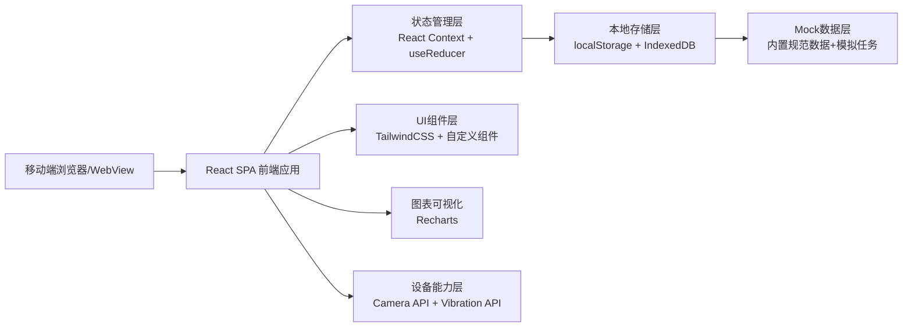
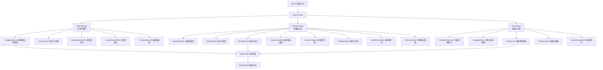

## 1. 架构设计



## 2. 技术描述

- 前端框架：React@18 + TypeScript
- 构建工具：Vite@5
- 样式方案：TailwindCSS@3
- 状态管理：React Context + useReducer（无需额外状态库，保持轻量）
- 路由管理：React Router DOM@6
- 图表库：Recharts@2（用于合格率环形图、条形图）
- 图标库：Lucide React（线性风格图标，符合工业务实风格）
- 数据持久化：localStorage（轻量配置）+ IndexedDB（存储测量数据和照片）
- 后端服务：无后端，纯前端Mock数据，支持离线使用
- 设备适配：移动端优先，响应式布局，兼容iOS/Android主流浏览器

## 3. 路由定义

| 路由路径 | 页面组件 | 功能说明 |
|---------|---------|---------|
| `/` | Redirect to `/tasks` | 默认重定向到任务列表 |
| `/tasks` | TaskListPage | 任务列表页：楼栋/楼层/户型/检查项选择 |
| `/measure/:taskId` | MeasurePage | 测量录入页：逐点数据录入、状态反馈 |
| `/result/:taskId` | ResultPage | 结果汇总页：合格率、问题清单、整改交接 |

## 4. 数据模型

### 4.1 核心数据结构定义

```typescript
// 楼栋信息
interface Building {
  id: string;
  name: string;          // 如 "1#楼"
  totalFloors: number;
  basementFloors: number; // 地下层数
}

// 楼层信息
interface Floor {
  id: string;
  buildingId: string;
  floorNumber: number;    // 负数表示地下，如-2表示B2
  displayName: string;    // 如 "3层"、"B1层"
  units: Unit[];
}

// 户型/单元
interface Unit {
  id: string;
  name: string;           // 如 "A户型"
  type: string;           // 如 "三房两厅"
  area: number;           // 建筑面积 ㎡
  rooms: Room[];
}

// 房间
interface Room {
  id: string;
  name: string;           // 如 "主卧"、"客厅"
  walls: Wall[];          // 墙面信息
}

// 墙面
interface Wall {
  id: string;
  direction: string;      // 东/南/西/北
  area: number;
}

// 检查项规范
interface InspectionStandard {
  id: string;
  name: string;           // 如 "墙面垂直度"
  category: string;       // 主体/装饰
  allowableDeviation: number; // 允许偏差 mm
  criticalRatio: number;  // 临界值比例，如0.8表示80%偏差为临界
  unit: string;           // 单位 mm
  pointsPerWall: number;  // 每面墙测点数
  description: string;    // 测量方法说明
}

// 测点点位
interface MeasurePoint {
  id: string;
  inspectionId: string;   // 关联检查项
  roomId: string;
  roomName: string;
  wallId?: string;
  location: string;       // 位置描述，如 "东墙-左"
  sequence: number;       // 测量顺序
  standardValue: number;  // 标准值
  allowableDeviation: number;
  status: 'pending' | 'measured' | 'recheck';
  measuredValue?: number;
  deviation?: number;     // 偏差值（带正负）
  deviationPercent?: number;
  result?: 'qualified' | 'critical' | 'out';
  photos: string[];       // 照片base64或blob url
  remark?: string;
  isRechecked?: boolean;
}

// 测量任务
interface MeasureTask {
  id: string;
  buildingId: string;
  buildingName: string;
  floorId: string;
  floorName: string;
  unitId: string;
  unitName: string;
  inspectionIds: string[]; // 选中的检查项ID
  points: MeasurePoint[];
  totalPoints: number;
  measuredPoints: number;
  qualifiedPoints: number;
  criticalPoints: number;
  outPoints: number;
  passRate: number;       // 合格率 0-100
  status: 'pending' | 'in_progress' | 'completed';
  startTime: number;      // timestamp
  endTime?: number;
  inspectorName: string;  // 测量人
  teamId?: string;        // 责任班组
  deadline?: number;      // 整改期限
}

// 班组信息
interface Team {
  id: string;
  name: string;           // 如 "抹灰一班"
  leader: string;
  phone: string;
  specialty: string;      // 专业工种
}
```

### 4.2 Mock初始数据

```typescript
// 内置检查项规范数据
const INSPECTION_STANDARDS: InspectionStandard[] = [
  {
    id: 'wall-vertical',
    name: '墙面垂直度',
    category: '装饰装修',
    allowableDeviation: 4,
    criticalRatio: 0.8,
    unit: 'mm',
    pointsPerWall: 3,
    description: '2m靠尺垂直方向测量'
  },
  {
    id: 'wall-flat',
    name: '墙面平整度',
    category: '装饰装修',
    allowableDeviation: 4,
    criticalRatio: 0.8,
    unit: 'mm',
    pointsPerWall: 3,
    description: '2m靠尺水平方向测量'
  },
  {
    id: 'room-depth',
    name: '开间进深',
    category: '主体结构',
    allowableDeviation: 10,
    criticalRatio: 0.8,
    unit: 'mm',
    pointsPerWall: 2,
    description: '激光测距仪测量房间净空'
  },
  {
    id: 'corner-square',
    name: '阴阳角方正',
    category: '装饰装修',
    allowableDeviation: 4,
    criticalRatio: 0.8,
    unit: 'mm',
    pointsPerWall: 1,
    description: '直角尺测量阴阳角'
  },
  {
    id: 'floor-flat',
    name: '地面平整度',
    category: '装饰装修',
    allowableDeviation: 5,
    criticalRatio: 0.8,
    unit: 'mm',
    pointsPerWall: 2,
    description: '2m靠尺测量地面'
  },
  {
    id: 'room-height',
    name: '净高',
    category: '主体结构',
    allowableDeviation: 15,
    criticalRatio: 0.8,
    unit: 'mm',
    pointsPerWall: 5,
    description: '激光测距仪测量5点取平均'
  }
];

// 示例楼栋数据
const BUILDINGS: Building[] = [
  { id: 'b1', name: '1#楼', totalFloors: 33, basementFloors: 2 },
  { id: 'b2', name: '2#楼', totalFloors: 33, basementFloors: 2 },
  { id: 'b3', name: '3#楼', totalFloors: 28, basementFloors: 2 }
];

// 示例班组数据
const TEAMS: Team[] = [
  { id: 't1', name: '抹灰一班', leader: '张建国', phone: '138****1234', specialty: '抹灰/墙面' },
  { id: 't2', name: '抹灰二班', leader: '李国强', phone: '139****5678', specialty: '抹灰/墙面' },
  { id: 't3', name: '土建一班', leader: '王建军', phone: '137****9012', specialty: '主体结构' },
  { id: 't4', name: '地坪班组', leader: '刘建设', phone: '136****3456', specialty: '地面工程' }
];
```

### 4.3 状态计算逻辑

```typescript
// 根据测量值计算偏差和结果状态
function calculateResult(
  measuredValue: number,
  standardValue: number,
  allowableDeviation: number,
  criticalRatio: number
): {
  deviation: number;
  deviationPercent: number;
  result: 'qualified' | 'critical' | 'out';
} {
  const deviation = measuredValue - standardValue;
  const deviationPercent = Math.abs(deviation) / allowableDeviation;
  
  let result: 'qualified' | 'critical' | 'out';
  if (deviationPercent > 1) {
    result = 'out';           // 超差：偏差 > 100%允许值
  } else if (deviationPercent >= criticalRatio) {
    result = 'critical';      // 临界：80% ≤ 偏差 ≤ 100%
  } else {
    result = 'qualified';     // 合格：偏差 < 80%
  }
  
  return { deviation, deviationPercent, result };
}
```

## 5. 组件架构



## 6. 性能与存储策略

- **照片压缩**：使用Canvas将拍照图片压缩至最大宽度1280px，质量70%，减少IndexedDB存储占用
- **分批存储**：测量数据每完成5个点自动保存一次，避免一次性写入大数据
- **内存优化**：照片使用Blob URL引用，卸载页面时释放object URL
- **离线支持**：所有核心功能纯前端实现，无需网络即可使用
- **数据导出**：生成JSON格式备份文件，支持导入恢复
